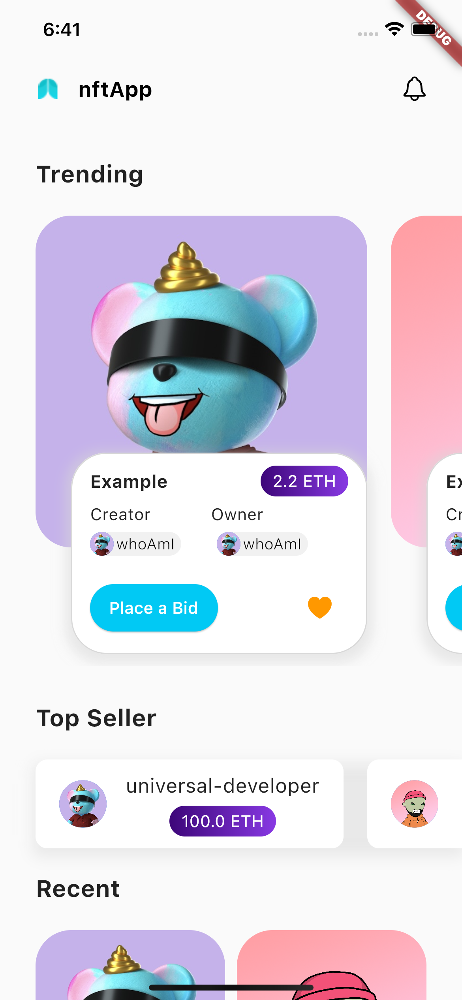
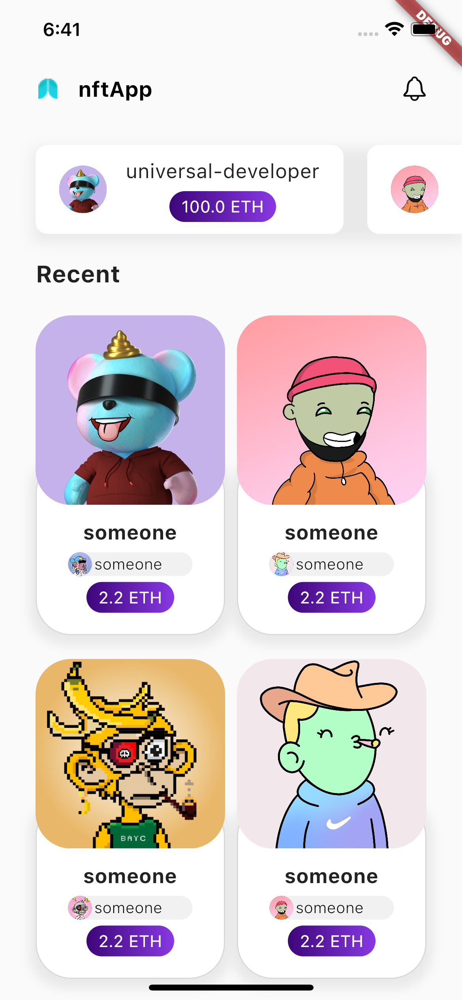

<h1>Flutter NFT App</h1>

<h2>Screens: </h2>

<p align="center">&nbsp;


<h2>Usage: </h2>

```bash

git clone https://github.com/universal-developer/Flutter-NFT-App

cd Flutter-NFT-App

flutter pub get

flutter run

```

<h2>Link on template: </h2>

```bash

https://www.figma.com/file/DiEhEw3u2QY0unDilNMJr9/Nft-App-(Community)?node-id=36%3A6

```
